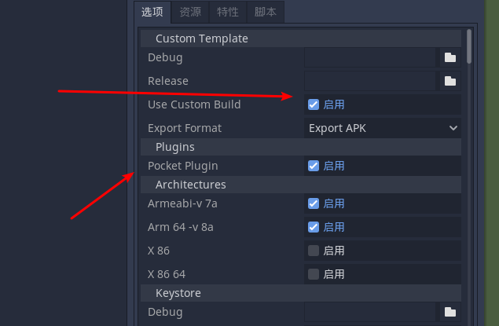

## godot口袋工厂安卓插件

### 使用说明
如果你的godot版本和我的版本不同，请下载源码自行编译一遍aar插件(为确保稳定兼容) 当然不这么做也可以，就是可能会闪退

<ol>
<li>下载插件，我全部放好在压缩包里了
</li>
<a href="https://gitee.com/small-sandbox/pocket-plugin/releases/2.0-stable-godot3.4.2">下载插件</a>
<li>安装godot安卓源码模板</li>


<li>将发布页面(release)的csj.xml复制到安卓源码目录/android/build/res/xml</li>
<li>如果必要的话，您可能需要使用发布页面(release)的Androidmaniestf.xml替换原始安卓源码模板里面的同名文件</li>
<li>参考我写的口袋工厂demo 版本：godot3.4.2，创建自己的application类，并将其添加到安卓源码目录中</li>
<a href="https://gitee.com/h128/godot-android-learn-plugin/tree/godot-3.4.2/">demo链接</a>
<li>编译导出</li>

</ol>

### 如何编译
1. 下载godot-libxxx.aar
2. 复制到godot-lib文件夹内，并重命名为godot-lib.aar
3. 使用android studio编译或者下面的代码编译
```
//windows
gradlew.bat PocketPlugin:build
//linux
./gradlew PocketPlugin:build
```
备注：你可能需要openjdk-11来编译（对于高版本godot）
